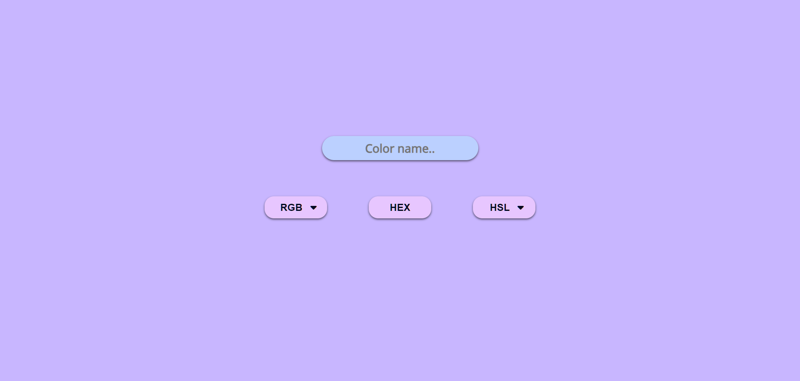

# ColorGenerator
#### Description : 
ColorGenerator is a user-friendly project that simplifies color selection process. Offering a range of color formats including hexadecimal, rgb, rgba, and hsl. ColorGen allows you to seamlessly switch between formats using intuitive drop-down menus with the chosen color code prominently displayed.

#### Demo : 
Watch the demo video on [YouTube](https://youtu.be/cnzmiq3e0ws).
#### Visit Website: https://color-generator-kvs.netlify.app/

